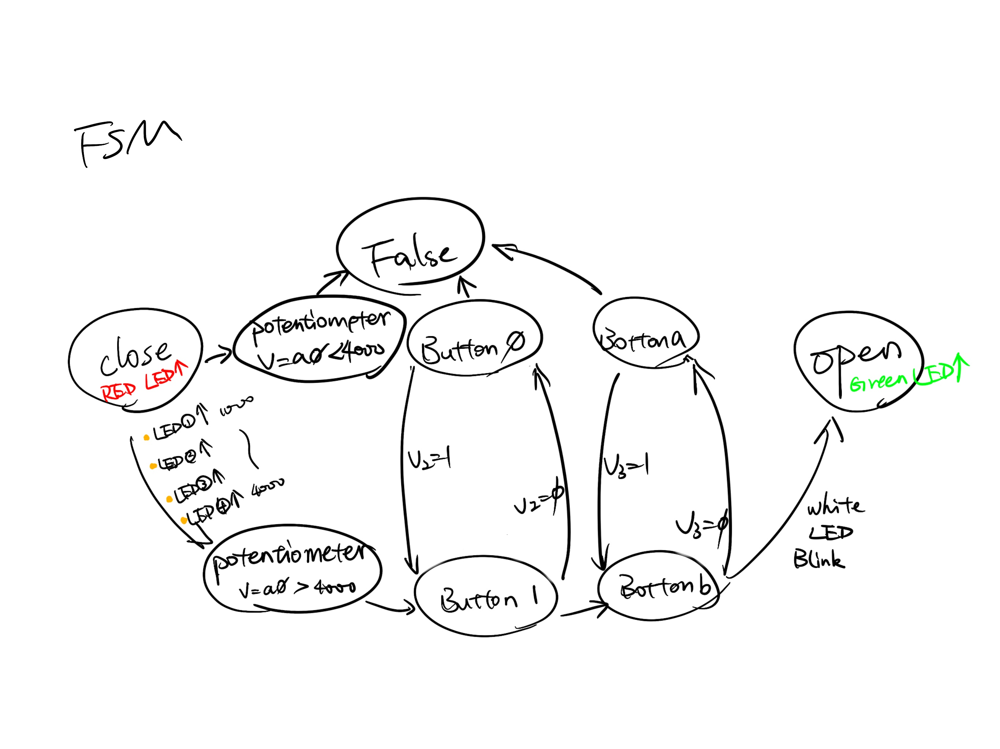
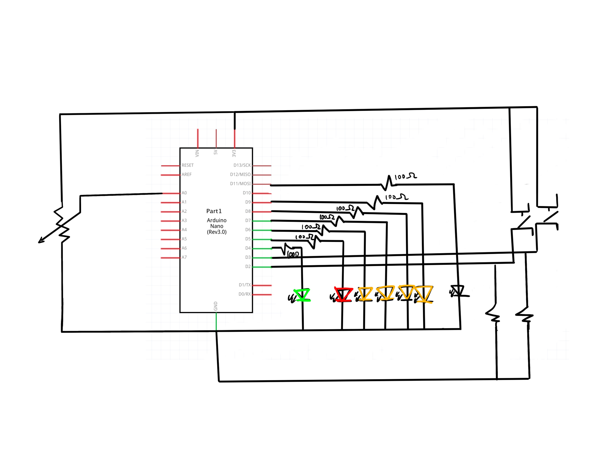

# HW11
The password should not be too simple, and according to the professor's requirements, it should involve at least three components. Initially, I planned to use two buttons and a potentiometer as part of the password. Following the content provided in the professor's tutorial, I decided to incorporate four different-colored LEDs to indicate the password input process.

After selecting the components and indicator lights, I needed to build the circuit on a breadboard and ensure its successful operation. I first connected the potentiometer and its four yellow LEDs because this combination forms an independent part of the password, unaffected by other components and dependent only on the operator's input. Afterward, I connected the other three main indicator lights: the red start and password incorrect LED, the green password-correct LED, and the white LED indicating that the password is currently being entered. Finally, I connected two buttons to the circuit.

In my design, the correct password requires the potentiometer output to be above 4000, meaning all four yellow LEDs need to be lit for the next step. At this point, the red LED will turn off, indicating that the white LED is blinking, signifying the ongoing password input. Following a correct password input, the green LED lights up. Any individual operation of the components alone will not result in the green LED lighting up. When people make incorrect password attempts, the red LED lights up, and the white LED indicating ongoing password input blinks. Only when the potentiometer output is above 4000 and both buttons are pressed simultaneously will the green LED light up, and the other colored LEDs will turn off. This outcome signifies a correct password.

Afterward, I began writing the code, clearly defining the limitations and final outputs for each scenario within the if() else() statements. Initially, when no operations are performed, only the red LED lights up, and the others remain off.

FSM

A schematic drawing of my circuit

Photo of my circuit

For me, two aspects posed a challenge. The first one is how to sensibly arrange them all on the breadboard. The board itself is not wide, and there are numerous components requiring connection to the 3V3 socket, negative terminal, and ground. Many wires intertwine, making it easy to misconnect or become entangled, making it challenging to differentiate the sockets. The second challenge is ensuring that each component of every part operates successfully together. Each part is not difficult to code separately, but when combined, especially with numerous prerequisites, errors can easily occur during code writing. These errors are often not easily detected and can visually create some confusion. Nevertheless, I am excited about the final outcome and successfully brought my conceptualized password lock to fruition.